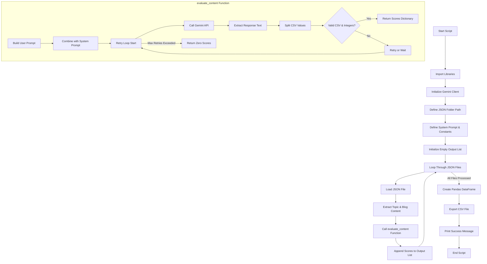

# Retrying blog evaluation with topic and blog contents from three different JSON files using Gemini API and saving the output for each of them in a single CSV file

This project is about retrying an evaluation for three blog topics from respective **JSON Files** based on different content marketing parameters through **Google GenAI** and saving the output in a **CSV File**

## Workflow

## Steps to Run the Code

1. Cloning the repository:

git clone: https://github.com/blackstag2k/Retry-Blog-Evaluation.git

2. Installing the Dependencies for the project:

* dependencies listed in the requirements.txt

pip install -r requirements.txt 

* If you want to execute the installed pip module instead of a script file, then use the command below in Command Window

pip -m install -r requirements.txt

### Example:

- python -m pip install google-generativeai

3. Add your API Key 

* Google AI API, Open AI API, etc. generated from any platform. Google GenAI key is used here. I have hardcoded the API key. However, I won't recommend hardcoding, rather you can save it as an environment variable. Hardcoding is done solely for personal convenience.

export GOOGLE_API_KEY="YOUR_KEY"

4. Run

python main.py

**Output**

Output CSV:
| Topic_Name | Readability_Score | Content_Structure_Score | Engagement_Score |
|-------|--------|--------|--------|
| AI Content Lead | 85 | 92 | 68 |
| Gen AI Artist | 94 | 97 | 91 |
| Prompt Engineering | 90 | 95 | 92 |

## Tools Used

- Google AI API (Gemini)
- Python 3.14

## Lessons to be Learned

- Using three different JSON files *AI Content Lead.json*, *gen_ai_artist.json*, and *Prompt Engineering.json* as inputs through *json_folder* and parsing the output in CSV file.
- Learning how to use *retry* process and understanding the usage of *MAX_RETRIES*, *except*, and *RETRY_DELAY*.
- Using prompt engineering basics to seperate system and user prompts. The former stays the same for all the three files and the latter variable or dynamic for the same.
- Understanding looping *for* on a folder *json_folder* and getting the *.json* files read all at once.
- Executing the code through a virtual environment (.venv) like VS Code.
- Prompt chaining to execute a prompt (system and user prompt) and get the best results.

Documented during the Prompt Engineering Course for Prompt Chaining and Content Generation

